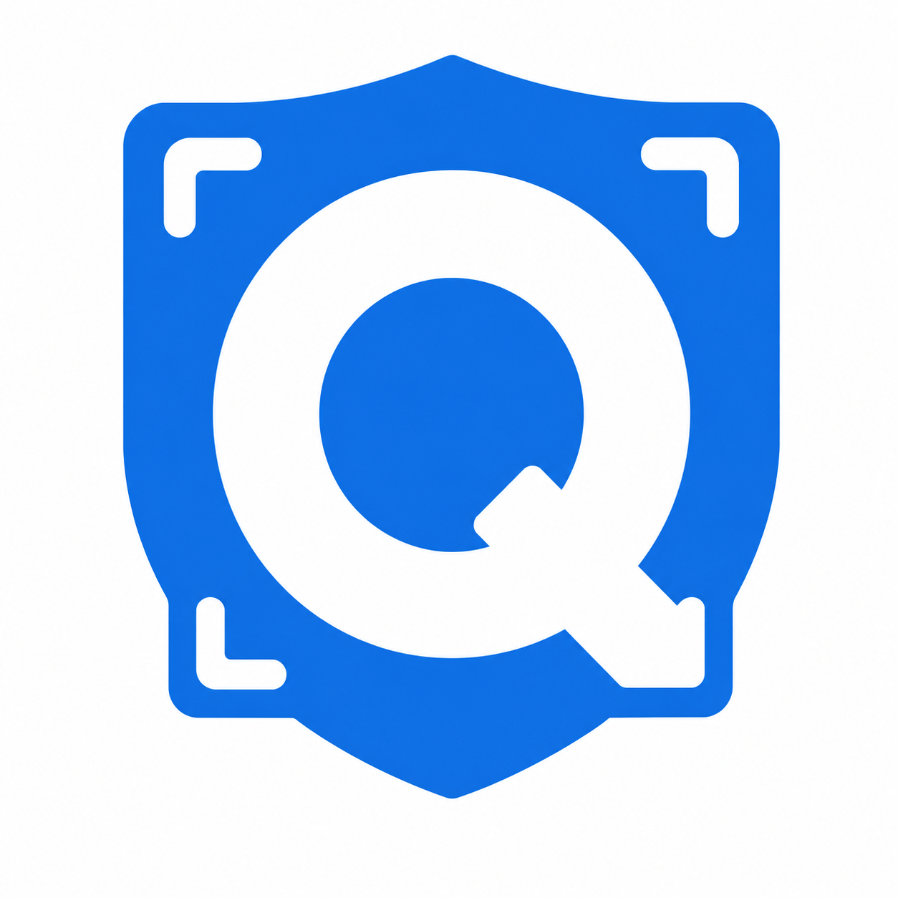
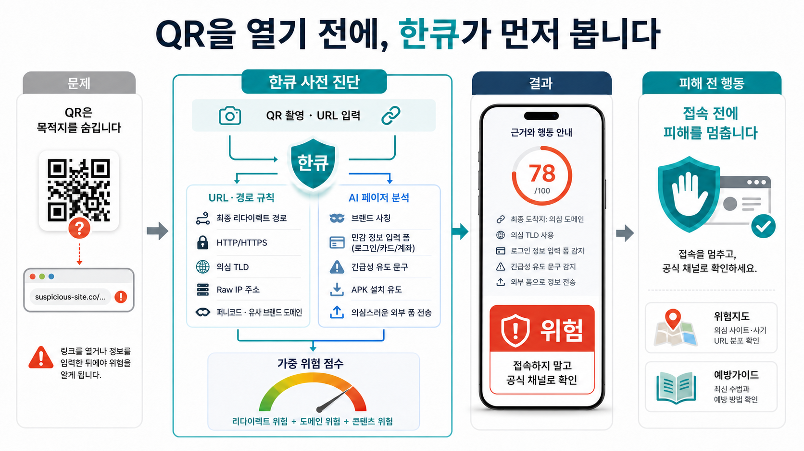
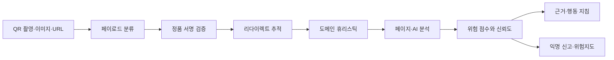
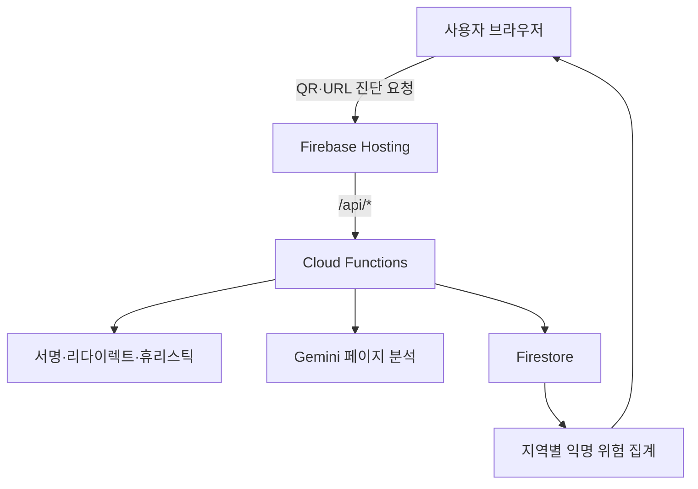

<p align="center">
  
</p>

<h1 align="center">한큐 HanQ</h1>

<p align="center">
  <strong>QR을 열기 전에, 한큐가 먼저 봅니다.</strong><br />
  QR의 최종 목적지와 페이지 내용을 접속 전에 분석해 큐싱 피해를 예방하는 웹 서비스
</p>

<p align="center">
  <a href="https://hanq-dev-17267.web.app"><strong>서비스 데모</strong></a>
  ·
  <a href="#핵심-기능">핵심 기능</a>
  ·
  <a href="#실행-방법">실행 방법</a>
</p>

<p align="center">
  
  
  
  
</p>

## 한눈에 보기

QR은 목적지를 숨기기 때문에 사용자는 링크를 연 뒤에야 위험을 알아차리기 쉽습니다. 한큐는 카메라 촬영, 이미지 업로드, URL 입력으로 받은 대상을 서버에서 먼저 확인하고, 위험 점수와 판단 근거, 즉시 해야 할 행동을 함께 제공합니다.

> 한큐의 핵심은 **피해가 발생한 뒤 신고하는 것에서, 접속 전에 위험을 차단하는 것으로 개입 시점을 앞당기는 것**입니다.



## 핵심 기능

| 기능 | 사용자 가치 |
| --- | --- |
| QR 실시간 스캔 | 모바일 카메라로 QR을 인식하고 링크를 직접 열지 않은 채 진단합니다. |
| 이미지·URL 진단 | 저장된 QR 이미지와 직접 입력한 주소도 동일한 절차로 확인합니다. |
| 다층 위험 분석 | 서명, 리다이렉트, 도메인 구조, 페이지 내용, AI 판독 결과를 종합합니다. |
| 설명 가능한 결과 | 안전·주의·위험 점수와 핵심 근거 3개, 상황별 행동 지침을 제공합니다. |
| 큐싱 위험지도 | 익명 신고를 지역 단위로 집계해 반복 발생 지역과 유형을 보여줍니다. |
| 예방·피해 대응 | 예방 수칙과 경찰청·금융감독원·KISA 신고 경로를 바로 안내합니다. |

## 진단 방식



진단 엔진은 한 신호만으로 안전을 단정하지 않습니다. 정품 서명 불일치나 실행형 스킴처럼 결정적인 신호는 즉시 차단하고, 일반 링크는 최종 도착지와 콘텐츠까지 단계적으로 확인합니다. 페이지를 읽지 못한 경우에도 위험 단서가 있으면 안전으로 통과시키지 않고 주의 판정을 유지합니다.

## 차별점

| 기존 대응의 한계 | 한큐의 접근 |
| --- | --- |
| 사용자가 링크를 연 뒤 의심 | QR을 여는 순간, 접속 전에 진단 |
| 표시된 주소만 확인 | 단축 URL과 다단계 리다이렉트의 최종 목적지 추적 |
| URL 문자열 중심 판별 | 로그인·결제 폼, 사칭 브랜드, 긴급 유도 문구 등 페이지 내용 분석 |
| 결과만 경고 | 점수, 판단 근거, 지금 해야 할 행동을 함께 제공 |
| 개별 피해로 끝남 | 익명 신고를 지역 위험 정보로 전환 |

## 아키텍처



| 영역 | 기술 |
| --- | --- |
| Frontend | React 19, TypeScript 6, Vite 8, Tailwind CSS 4, React Router, Leaflet |
| Backend | Firebase Functions, Node.js 22, Firebase Admin SDK |
| Data | Cloud Firestore, geohash 기반 지역 집계 |
| Analysis | 규칙 기반 URL 분석, 리다이렉트 추적, Gemini 페이지·비전 분석 |
| Quality | ESLint, TypeScript strict mode, Node Test Runner, 내부 벤치마크 |

## 보안과 개인정보 보호

- Gemini API 키와 QR 서명 키는 브라우저에 포함하지 않고 Firebase Secret Manager에서 관리합니다.
- 리다이렉트 추적 중 내부망 주소 접근을 차단해 SSRF 위험을 줄입니다.
- 신고 API에 요청 제한을 적용해 허위 신고와 지도 오염을 완화합니다.
- 위험지도는 원본 좌표를 저장하지 않고 구 단위 및 약 150m 격자로 집계합니다.
- QR 정품 여부는 HMAC 서명으로 검증하며, 불일치는 위조로 즉시 판정합니다.

## 검증 결과

2026년 7월 22일 현재 제출 브랜치 기준입니다.

| 항목 | 결과 |
| --- | --- |
| 프런트·Vite·Functions 타입 검사 | 통과 |
| 백엔드 단위 테스트 | 26개 통과 |
| ESLint | 통과 |
| 내부 URL 판별 벤치마크 | 205건 정답, 재현율 100%, 오탐 0건 |

벤치마크 수치는 라벨링된 내부 데이터셋에 대한 회귀 테스트 결과이며, 실제 환경의 모든 큐싱 탐지를 보장하는 수치가 아닙니다.

## 실행 방법

### 요구 환경

- Node.js 22
- npm
- 전체 백엔드 실행 시 Firebase CLI와 Firebase 프로젝트

### 1. 의존성 설치

```bash
npm install --no-audit --no-fund
npm --prefix functions install --no-audit --no-fund
```

### 2. 로컬 백엔드 환경 설정

`functions/.env.example`을 `functions/.env`로 복사한 뒤 필수 값을 입력합니다. 운영 배포에서는 `.env` 대신 Firebase Secret Manager를 사용합니다.

필수 값은 `GEMINI_API_KEY`, `HANQ_SIGNING_SECRET`이며 나머지는 선택 사항입니다.

### 3. 실행

백엔드 에뮬레이터를 먼저 실행하고, 별도 터미널에서 프런트엔드를 실행합니다.

```bash
npm --prefix functions run serve
npm run dev
```

### 4. 전체 검증

```bash
npm run check
```

## 프로젝트 구조

```text
src/                 React 화면·QR 스캔·결과·위험지도
functions/src/       검증 API·신고·지도 집계·공통 보안 로직
scripts/             URL 판별 회귀 벤치마크
docs/                백엔드 통합 설계와 구현 기록
assets/              README 대표 이미지
firebase.json        Hosting·Functions·Firestore 구성
```

## 판정 원칙과 한계

- 한큐의 결과는 위험 판단을 돕는 보조 정보이며 금융기관이나 수사기관의 공식 판정을 대체하지 않습니다.
- 외부 페이지 차단, 네트워크 오류, 캡차 등으로 내용을 확인하지 못하면 신뢰도가 낮아질 수 있습니다.
- 위험지도는 사용자 신고 기반이므로 요청 제한과 익명 집계를 적용해도 데이터 편향 가능성이 있습니다.
- 새로운 공격 패턴에 대응하기 위해 규칙, 모델, 회귀 데이터셋을 지속적으로 갱신해야 합니다.

---

<p align="center">
  <strong>Team 20 · HanQ</strong><br />
  큐싱 피해를 접속 전에 멈추기 위한 사전 진단 서비스
</p>
